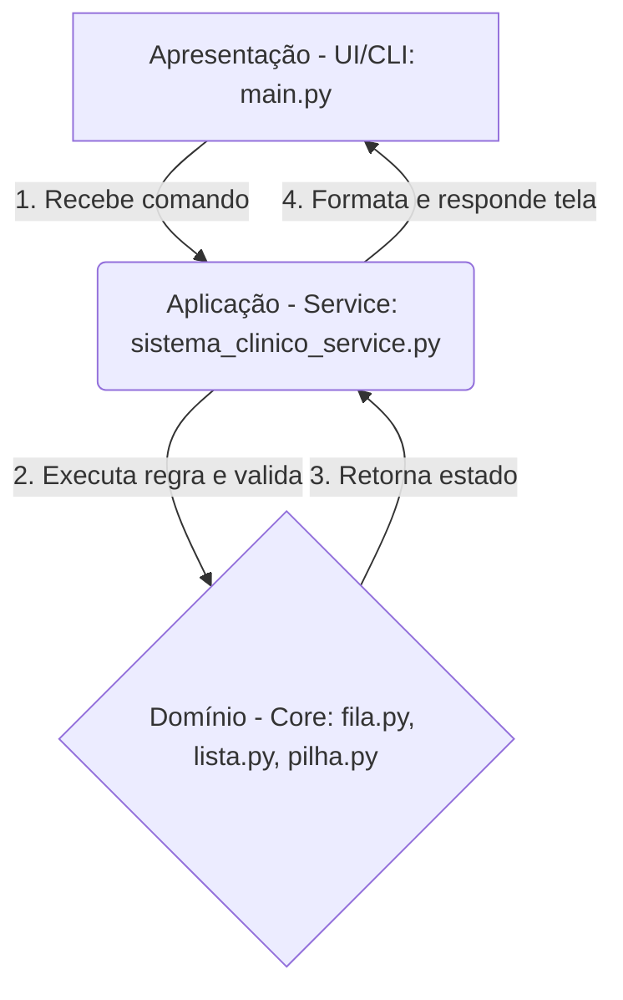

# Design Técnico e MVP — E2
**Estrutura de Dados**
**Prazo:** 14/05 | **Peso na nota:** 25% da nota final

---

## Identificação do Grupo

| Campo | Preenchimento |
|-------|---------------|
| Nome do projeto | Sistema de Gestão de Fluxo Clínico |
| Repositório GitHub | https://github.com/ipedro7/sistema-fluxo-clinico |
| Integrante 1 | Pedro — ipedro7 |
| Integrante 2 | Wendel — wendel1 |

---

## 1. Escolha e Justificativa das Estruturas de Dados

### Estrutura 1 — Lista Encadeada Simples

**Nome completo e categoria:**
Lista Encadeada Simples — estrutura linear dinâmica

**Complexidade das operações principais:**

| Operação | Tempo | Espaço | Observação |
|----------|-------|--------|------------|
| Inserção | O(1) ou O(n) | O(1) | O(1) no início e O(n) no final se sem ponteiro tail |
| Remoção  | O(n) | O(1) | Precisa buscar o elemento antes de remover |
| Busca    | O(n) | O(1) | Busca sequencial a partir da cabeça |
| Acesso   | O(n) | O(1) | Acesso sequencial (não há acesso indexado em tempo constante) |

**Justificativa de escolha:**
Escolhida para o cadastro geral de pacientes. Em um sistema real, não se sabe de antemão a quantidade exata de pacientes cadastrados. A lista encadeada permite crescimento dinâmico da coleção sem realocações caras.

**Alternativa descartada:**
Array Estático — Descartado pois limitaria o sistema a um número máximo pré-definido de pacientes, ou forçaria uso de Arrays Dinâmicos com operações de redimensionamento custosas de memória caso o array fique cheio.

**Limitações conhecidas:**
Operações de busca e acesso requerem tempo linear O(n), o que pode ser ineficiente em bancos de dados gigantescos (para os quais seriam recomendadas árvores ou tabelas hash).

**Referência bibliográfica:**
CORMEN, T. H. et al. Algoritmos: Teoria e Prática. 3. ed. Elsevier, 2012.

---

### Estrutura 2 — Fila (Queue)

**Nome completo e categoria:**
Fila (Queue) — estrutura linear baseada em política FIFO

**Complexidade das operações principais:**

| Operação | Tempo | Espaço | Observação |
|----------|-------|--------|------------|
| Inserção | O(1) | O(1) | Inserção rápida no final (rear) |
| Remoção  | O(1) | O(1) | Remoção rápida no início (front) |
| Busca    | O(n) | O(1) | Busca linear (embora incomum e não encorajada em filas) |
| Acesso   | O(1) | O(1) | Apenas acesso ao elemento da frente (Peek / Frente) |

**Justificativa de escolha:**
Perfeita para a fila de espera do atendimento clínico, uma vez que segue rigorosamente o princípio FIFO (First-In, First-Out), refletindo a realidade de atendimento por ordem de chegada em qualquer sistema de fluxo.

**Alternativa descartada:**
Lista Comum com remoção e inserção arbitrárias — Descartada pois permitiria remover ou inserir elementos fora das pontas, ferindo a regra de negócio do atendimento justo e sequencial da clínica.

**Limitações conhecidas:**
Na fila básica adotada, não é possível introduzir prioridades complexas (como pacientes idosos ou urgências) sem alterar a estrutura para uma Fila de Prioridade (Priority Queue).

**Referência bibliográfica:**
CORMEN, T. H. et al. Algoritmos: Teoria e Prática. 3. ed. Elsevier, 2012.

---

### Estrutura 3 — Pilha (Stack)

**Nome completo e categoria:**
Pilha (Stack) — estrutura linear baseada em política LIFO

**Complexidade das operações principais:**

| Operação | Tempo | Espaço | Observação |
|----------|-------|--------|------------|
| Inserção | O(1) | O(1) | Inserção no topo (Push) |
| Remoção  | O(1) | O(1) | Remoção do topo (Pop) |
| Busca    | O(n) | O(1) | Busca linear (incomum em pilhas) |
| Acesso   | O(1) | O(1) | Acesso apenas ao elemento do topo (Peek) |

**Justificativa de escolha:**
Utilizada para o histórico de ações do sistema. Como queremos saber qual foi a "última ação executada" ou "desfazer a última ação", o comportamento LIFO (Last-In, First-Out) encaixa perfeitamente.

**Alternativa descartada:**
Fila — Descartada pois a fila nos daria a "primeira ação que fizemos na história" e não a mais recente, impossibilitando um recurso eficiente de "desfazer ou ver última ação".

**Limitações conhecidas:**
Apenas é possível acessar facilmente o estado mais recente (o topo), sem permitir acesso aleatório aos históricos passados mais profundos sem ter que desempilhar todo o resto.

**Referência bibliográfica:**
CORMEN, T. H. et al. Algoritmos: Teoria e Prática. 3. ed. Elsevier, 2012.

---

## 2. Arquitetura em Camadas

**Diagrama:**



**Descrição das camadas:**

| Camada | Nome no seu projeto | Responsabilidade |
|--------|---------------------|-----------------|
| Apresentação (UI/CLI) | `src/ui/main.py` | Interfaces em terminal, captação das opções de input, loop principal, exibição formatada de resultados. |
| Aplicação (Service) | `src/service/sistema_clinico_service.py` | Recebe a intenção da interface, aplica as regras (como checar se a fila não está vazia, ID inválido) e orquestra o banco em memória (chamando a estrutura de dados correta). |
| Domínio (Core) | `src/core/` (fila.py, pilha.py, paciente.py...) | Responsável apenas pelas lógicas estritas da Estrutura de Dados em si. A estrutura abstrai o funcionamento interno e opera dados genéricos. |

**Como as camadas se comunicam:**
A interface CLI (`main.py`) recebe uma escolha (Ex: "Chamar próximo paciente"). Ela passa essa solicitação para o `sistema_clinico_service.py`. O Service consulta a estrutura do Core (ex: Fila) chamando `self.fila.dequeue()`. Se a Fila retornar `None` porque está vazia, o Service devolve uma tupla de erro para a CLI exibir a mensagem adequada. Se retornar um paciente, o Service faz o log no Histórico (`self.historico.push()`) lá no Core, e envia os dados do paciente de volta para a CLI printar na tela.

---

## 3. Estrutura de Diretórios

```
/
├── src/
│   ├── core/
│   ├── service/
│   └── ui/
├── tests/
├── data/
├── doc/
└── README.md
```

**Justificativa de desvios (se houver):**
Nenhum desvio. A organização respeita as recomendações propostas.

---

## 4. Backlog do Projeto

### In-Scope — O que será implementado

**Item 1:** Cadastrar novo paciente

Critério de aceite:
> **Dado** o menu inicial ou a tela de cadastro,
> **quando** o usuário preenche o ID, Nome e Idade válidos,
> **então** o sistema insere o paciente na Lista Encadeada e avisa com mensagem de sucesso (salvando a ação no histórico da pilha).

---

**Item 2:** Enfileirar para atendimento

Critério de aceite:
> **Dado** um ID de paciente existente e válido,
> **quando** o usuário o adiciona na fila de atendimento,
> **então** o paciente entra para o final da Fila e a operação é documentada no histórico com uma mensagem de sucesso, ficando pronto para atendimento.

---

**Item 3:** Chamar próximo paciente

Critério de aceite:
> **Dado** que há pacientes aguardando na fila,
> **quando** o atendente usa a opção "Chamar próximo",
> **então** o sistema remove o paciente do início da Fila (Dequeue) O(1), exibe suas informações para atendimento e o histórico é atualizado indicando o paciente atendido.

---

**Item 4:** Consultar Fila de Espera

Critério de aceite:
> **Dado** a solicitação do usuário para ver a fila de espera,
> **quando** acionada a opção correspondente no menu principal,
> **então** o sistema exibe os elementos atuais contidos na fila em ordem e sem modificá-la usando operação segura de listagem O(n).

---

**Item 5:** Ler dados em massa de Arquivo TXT

Critério de aceite:
> **Dado** que existe um arquivo `data/pacientes.txt` com dados no formato ID;Nome;Idade do paciente,
> **quando** a opção de carregar for acionada pelo operador,
> **então** o sistema iterativamente lê as linhas, cria objetos instanciando a classe Paciente, e preenche o cadastro geral (Lista Encadeada) reportando sucesso.

---

### Out-of-Scope — O que não será implementado

| Funcionalidade | Motivo de exclusão |
|----------------|--------------------|
| Persistência de Banco Relacional (SQL) | Fora do escopo do semestre, o foco da disciplina são as estruturas em memória e complexidade algorítmica associada à manipulação do dado. |
| Interface Gráfica / Web (GUI) | A criação de telas visuais demanda frameworks extras, sendo a interface de Linha de Comando (CLI) mais pragmática e aceitável para a validação das operações MVP. |
| Autenticação de Usuários / Login | Complexidade extra desnecessária que não agrega ao aprendizado do conteúdo central de Estruturas de Dados exigido pelo sistema atual. |

---

## 5. Repositório GitHub

**Link do repositório:** https://github.com/ipedro7/sistema-fluxo-clinico

**Checklist do repositório:**
- [x] Repositório público com nome descritivo
- [x] `.gitignore` configurado para a linguagem escolhida
- [x] `README.md` com nome, descrição e instruções de execução
- [x] Mínimo de 5 commits com prefixos semânticos (`feat:`, `fix:`, `test:`, `docs:`, `refactor:`)

**Como executar o projeto**:

```bash
# Como o projeto não utiliza dependências externas pesadas além de libs padrão (caso não exista requirments, roda nativamente com python3)
# Estando na raiz da pasta:
python src/ui/main.py
```

---

## 6. Implementação do Núcleo

### 6.1 Estrutura implementada: Fila (Queue)

**Linguagem:** Python 3.11+

**Localização no repositório:** `src/core/fila.py`

**Operações implementadas:**

| Operação | Implementada? | Observação |
|----------|---------------|------------|
| `enqueue(valor)` | ✅ | Adiciona o item ao fim da fila (rear) em tempo O(1) |
| `dequeue()` | ✅ | Retira do início (front) da fila devolvendo o valor O(1) |
| `frente()` | ✅ | Devolve o elemento da frente (peek) sem alterar fila O(1) |
| `exibir()` | ✅ | Retorna representação da fila atual |

**Trecho representativo do código** *(operação principal)*:

```python
    def dequeue(self):
        if self.estava_vazia():
            return None
            
        valor = self.primeiro.valor
        self.primeiro = self.primeiro.proximo
        self.tamanho -= 1
        
        # Se esvaziou a fila limpamos o ponteiro de último também
        if self.primeiro is None:
            self.ultimo = None
            
        return valor
```

**Leitura de arquivo:**
O sistema lê dados de arquivo Texto delimitado. O formato atual é um TXT separado por ponto e vírgula (como um CSV customizado). O caminho esperado pelo script é `data/pacientes.txt`. A estrutura é processada quebrando pelo `split(";")`.

Exemplo de arquivo de entrada (`data/pacientes.txt`):
```text
1;Ana Silva;34
2;João Pereira;45
3;Maria Oliveira;22
4;Pedro Lima;60
```

---

## 7. MVP — Mínimo Produto Viável

### 7.1 Tipo de interface

- [x] CLI (linha de comando)
- [ ] GUI desktop (Tkinter, JavaFX, outro: __________)
- [ ] Web (HTML/JS, outro: __________)

### 7.2 Tela 1 — Boas-vindas / Menu Principal

**Descrição:** Ponto de entrada. Um menu no terminal limpo exibe o título e as opções infinitamente em um laço para o usuário interagir.

**Print ou representação textual:**
```text
=== SISTEMA DE GESTÃO DE FLUXO CLÍNICO ===

1. Cadastrar Paciente
2. Listar Pacientes
3. Buscar Paciente
4. Remover Paciente
5. Adicionar à Fila de Atendimento
6. Chamar Próximo Paciente
7. Ver Fila de Atendimento
8. Relatórios Ordenados
9. Ver Histórico de Ações
10. Desfazer Última Ação
11. Carregar Dados Iniciais
12. Dashboard
0. Sair

Escolha uma opção: 
```

**Comportamentos implementados nesta tela:**
- [x] Nome do sistema exibido
- [x] Lista de operações disponíveis
- [x] Opção de sair

---

### 7.3 Tela 2 — Entrada de Dados

**Descrição:** Como o usuário interage e informa os dados dentro das opções. Fluxos rápidos de pergunta-resposta pelo prompt `input()`.

**Print ou representação textual:**
```text
Escolha uma opção: 1

--- Cadastrar Paciente ---
ID do Paciente: 1
Nome do Paciente: Carlos Almeida
Idade: 45

>> Paciente Carlos Almeida cadastrado com sucesso.
```

**Comportamentos implementados nesta tela:**
- [x] Campo ou prompt para inserir valor
- [x] Opção de carregar arquivo (via item 11 do menu que não pede mais inputs)
- [x] Confirmação da ação antes de executar ou após concluir

---

### 7.4 Tela 3 — Resultado

**Descrição:** Onde o sistema exibe os resultados da operação executada. Caso a operação seja inválida ele mostra feedback de erro.

**Print ou representação textual:**
```text
Escolha uma opção: 6

>> ERRO: fila vazia. Não há pacientes para chamar.

---------------------------------------------------

Escolha uma opção: 7

--- Fila de Atendimento ---
1. Carlos Almeida (Idade: 45) - ID: 1
2. Maria Rita (Idade: 33) - ID: 2
```

**Comportamentos implementados nesta tela:**
- [x] Resultado da operação executada
- [x] Estado atual completo da estrutura
- [x] Mensagem de erro para operações inválidas (ex.: pop em pilha vazia)

---

### 7.5 Fluxo completo demonstrado

**Cenário:** Usuário inicializa o programa vazio, adiciona um paciente usando o menu 1 (cadastrar paciente), em seguida o adiciona na fila usando a opção 5, por fim usa o item 6 e ele atende/remove o paciente de fato.

```text
=== SISTEMA DE GESTÃO DE FLUXO CLÍNICO ===
1. Cadastrar Paciente
...
0. Sair
Escolha uma opção: 1
--- Cadastrar Paciente ---
ID do Paciente: 1
Nome do Paciente: João Carlos
Idade: 25
>> Paciente João Carlos cadastrado com sucesso.

Escolha uma opção: 5
--- Adicionar à Fila ---
ID do Paciente: 1
>> Paciente João Carlos adicionado à fila.

Escolha uma opção: 6
--- Chamar Próximo Paciente ---
>> Próximo paciente chamado: João Carlos.

Escolha uma opção: 6
--- Chamar Próximo Paciente ---
>> ERRO: fila vazia. Não há pacientes para chamar.
```

---

## 8. Testes Unitários

**Framework de testes utilizado:** pytest

**Localização:** `tests/test_fila.py`

### Estrutura testada: Fila

---

**Teste 1 — Caso base**

Descrição: Verifica se inserir um elemento e removê-lo em seguida devolve os dados consistentes do objeto `Paciente`.

```python
def test_enqueue_dequeue():
    fila = Fila()
    paciente = Paciente(1, "Ana", 32)
    
    fila.enqueue(paciente)
    
    assert fila.dequeue() == paciente
```

Resultado: ✅ Passando 

---

**Teste 2 — Caso vazio**

Descrição: Comportamento da fila totalmente vazia (edge-case). Quando chamada a remoção (`dequeue`), não deve estourar um erro mas sim retornar fallback (`None`).

```python
def test_dequeue_fila_vazia():
    fila = Fila()
    
    assert fila.dequeue() is None
```

Resultado: ✅ Passando 

---

**Teste 3 — Caso com múltiplos elementos**

Descrição: Garante que a fila respeite perfeitamente o seu padrão estrito FIFO manipulando sequências de entradas e saídas e checando a ordem exata de integridade.

```python
def test_fila_fifo_multiplos_pacientes():
    fila = Fila()
    p1 = Paciente(1, "Ana", 32)
    p2 = Paciente(2, "Carlos", 45)
    p3 = Paciente(3, "Mariana", 28)

    fila.enqueue(p1)
    fila.enqueue(p2)
    fila.enqueue(p3)

    assert fila.dequeue() == p1
    assert fila.dequeue() == p2
    assert fila.dequeue() == p3
```

Resultado: ✅ Passando 

---

## Checklist de Autoavaliação

Antes de entregar, verifique se você:

**Seção 1 — Estruturas**
- [x] Big-O preenchido para inserção, remoção, busca e acesso de cada estrutura
- [x] Pelo menos 1 alternativa descartada com justificativa técnica
- [x] Limitações conhecidas descritas
- [x] Referência bibliográfica fornecida

**Seção 2 — Arquitetura**
- [x] Diagrama com as 3 camadas visíveis
- [x] Fluxo de comunicação entre camadas descrito

**Seção 3 — Diretórios**
- [x] Árvore de diretórios presente
- [x] Desvios do modelo justificados (ou "Nenhum desvio" declarado)

**Seção 4 — Backlog**
- [x] 5 ou mais itens In-Scope com critério de aceite no formato Dado/Quando/Então
- [x] 3 ou mais itens Out-of-Scope com justificativa

**Seção 5 — Repositório**
- [x] Link do repositório público informado
- [x] README.md com instruções de execução
- [x] Mínimo de 5 commits semânticos

**Seção 6 — Núcleo**
- [x] Pelo menos 1 estrutura completamente implementada
- [x] Leitura de arquivo funcionando
- [x] Trecho de código representativo incluído no template

**Seção 7 — MVP**
- [x] 3 telas documentadas com print ou representação textual
- [x] Fluxo completo de ponta a ponta demonstrado
- [x] Mensagem de erro para operação inválida implementada
- [x] Loop de menu funcionando (programa não encerra após 1 operação)

**Seção 8 — Testes**
- [x] 3 testes por estrutura documentados neste template
- [x] Resultado de cada teste indicado (✅ / ❌)

---

*Nome do arquivo de entrega: `E2_Grupo5_Design_Tecnico.md`*
*Este arquivo deve estar na pasta `/doc` do repositório.*
